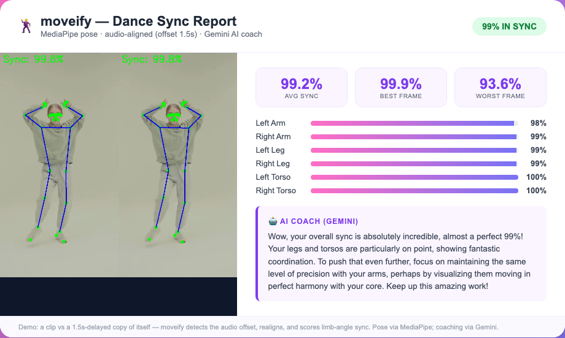
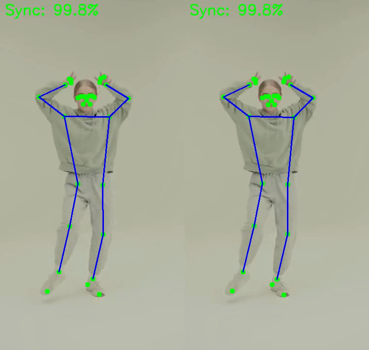
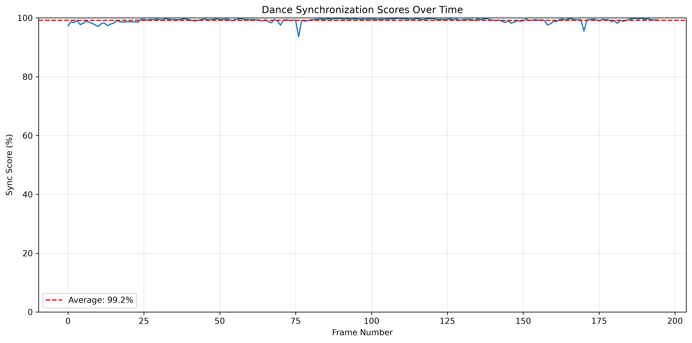
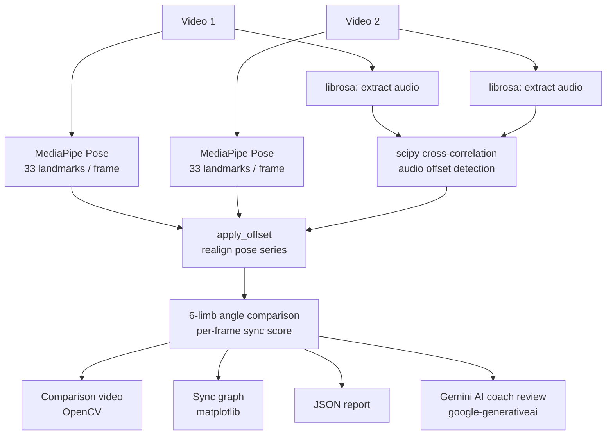

# moveify — Dance Sync Analysis

**Give it two dance videos. It detects the audio offset, aligns them, scores every limb frame-by-frame, and hands you a Gemini AI coaching review.**

---

## Demo

> **Test:** one real dance clip vs a 1.5-second-delayed copy of itself.
> moveify detected the 1.5 s audio offset, realigned the pose series, and scored **99.2 % average sync** — proving the alignment is real.



### Live Gemini coach review (captured from the demo run)

> *"Wow, your overall sync is absolutely incredible, almost a perfect 99%! Your legs and torsos are particularly on point, showing fantastic coordination. To push that even further, focus on maintaining the same level of precision with your arms, perhaps by visualizing them moving in perfect harmony with your core. Keep up this amazing work!"*

### Side-by-side MediaPipe pose skeletons



### Sync score over time



[comparison.mp4 — rendered comparison video](docs/demo/comparison.mp4)

---

## Architecture



---

## Tech Stack

| Layer | Library | Version |
|-------|---------|---------|
| Vision | MediaPipe (`mp.solutions.pose`, 33 landmarks) | `>=0.10.9,<0.10.19` |
| Vision | OpenCV (video decode/encode, overlay) | latest |
| Audio DSP | librosa (audio extraction) | latest |
| Audio DSP | scipy (cross-correlation offset detection) | latest |
| Numerics | numpy | latest |
| Visualisation | matplotlib (sync graph) | latest |
| AI coach | google-generativeai (Gemini) | latest |
| UI | Tkinter (GUI) | stdlib |
| Runtime | Python | 3.11 |

> **MediaPipe note:** the legacy `mp.solutions.pose` API was removed in 0.10.19. The pinned range `>=0.10.9,<0.10.19` is intentional.

---

## Highlight: Audio-Aligned Sync

The core technical contribution is genuine time alignment before scoring.

`find_audio_offset` extracts the audio tracks from both videos and runs a scipy cross-correlation to find the sample-level lag between them. That offset is passed to `apply_offset`, which shifts the pose landmark series so both sequences start at the same moment in the dance. Scoring is then done on the aligned poses — not raw wall-clock frames — so a sync score of 99 % actually means the bodies are in sync, not that the videos happened to start at the same time.

A silent-audio guard prevents a divide-by-zero crash when either track is silent or degenerate.

---

## Setup

```bash
# Python 3.11 required
pip install -r requirements.txt

# Optional: enable the Gemini AI coach
cp .env.example .env
# then set GEMINI_API_KEY=<your key> in .env
# Without a key, moveify uses a templated coach review instead.
# Override the model with GEMINI_MODEL (default: gemini-2.5-flash-lite)
```

---

## Usage

### CLI

```bash
python dance.py video1.mp4 video2.mp4 --output-dir out/
```

Outputs to `out/`: `comparison.mp4`, `sync_scores.png`, `dance_analysis_report.json`.

### GUI

```bash
python dance_gui.py
```

Opens a Tkinter window. Browse for two video files, run analysis, view results inline — the Gemini coach review is shown in a scrollable text panel. Analysis runs on a background thread so the UI stays responsive.

---

## Testing

```bash
pip install pytest
pytest -m "not integration"   # 13 tests; Gemini is mocked
```

CI runs the same suite on every push (see `.github/workflows/`).

---

## Project Structure

```
dance.py          — CLI entry point and core pipeline
coach.py          — Gemini AI coach integration with templated fallback
dance_gui.py      — Tkinter GUI
pose_tracker.py   — MediaPipe pose extraction and limb-angle math
tests/            — pytest suite (unit + integration markers)
docs/demo/        — captured demo proof (sync-report.png, comparison-frame.png, sync_scores.png, comparison.mp4, dance_analysis_report.json)
```
